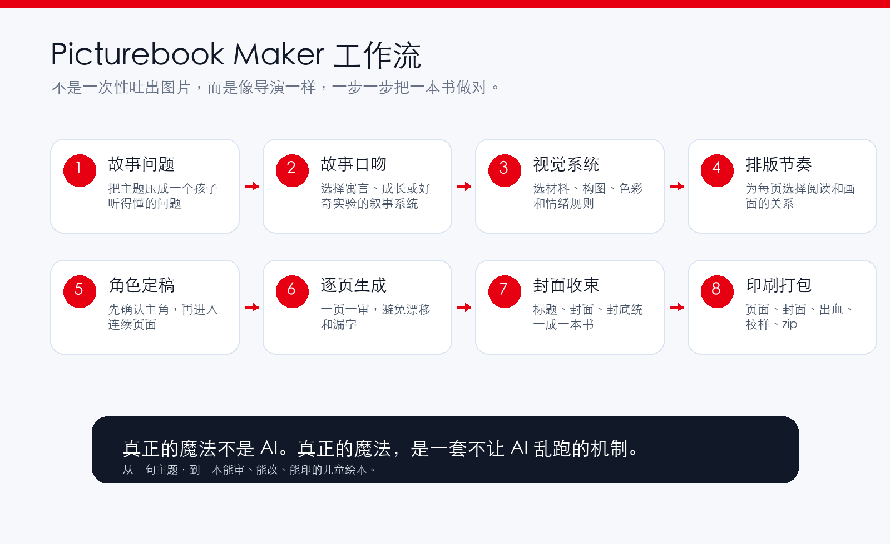
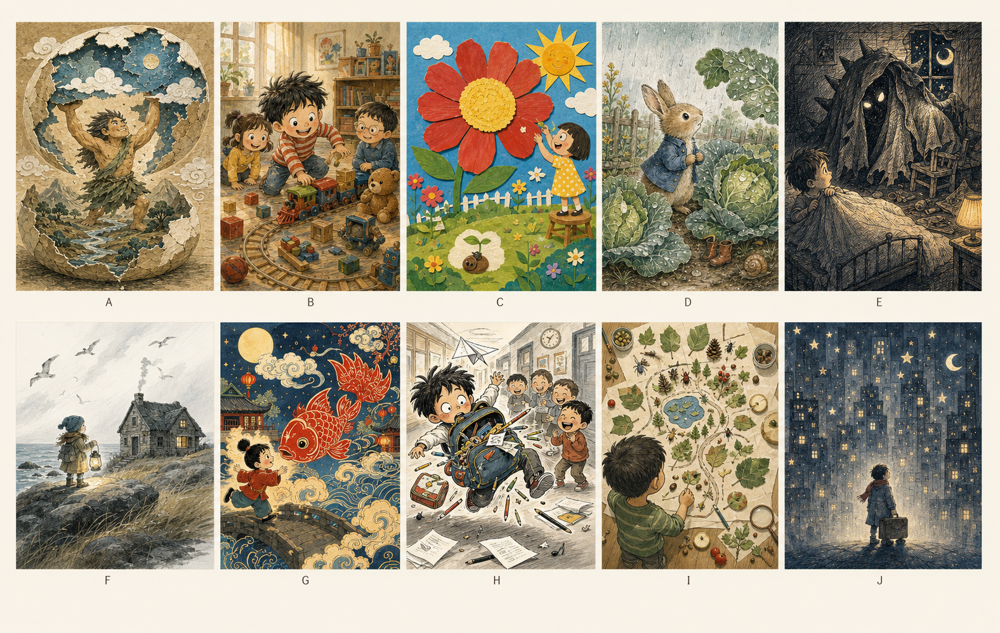
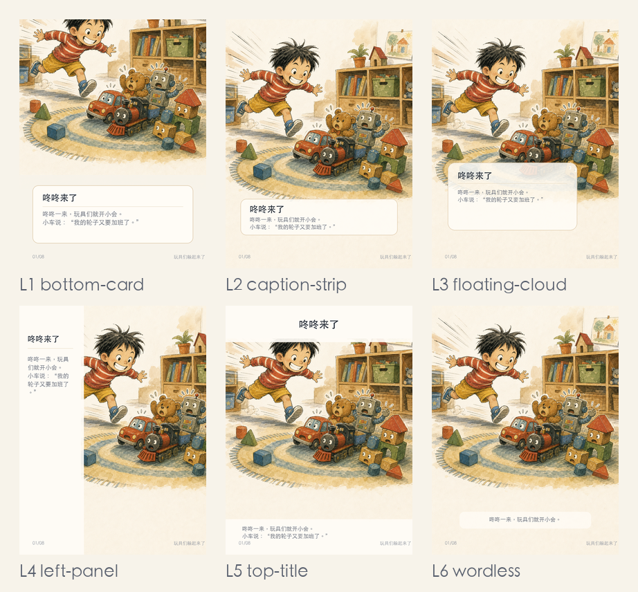

# picturebook-maker

把一句想给孩子讲的道理，做成一本能审、能改、能打印的儿童绘本。


这不是一个“生成几张图”的技能包。那太容易了，也太普通了。`picturebook-maker` 更像一间小型绘本工作室：它会追问故事，会固定角色，会安排镜头，会排版文字，最后把所有东西打包成能打印的一本书。

## 一句话

**从一句主题，到一套可审稿、可修改、可印刷的儿童绘本资产。**

它解决的是 AI 绘本最容易翻车的四件事：文字丢失、角色漂移、排版单调、不能直接印。它不把创作过程一次性扔给模型，而是把一本绘本拆成几个必须确认的关键决策。



## 这个仓库里有什么

```text
picturebook-maker/
  SKILL.md
  README.md
  templates/
  references/illustrators/
  scripts/
  readme-assets/

picturebook-maker-skill.zip
```

完整介绍请看 [picturebook-maker/README.md](picturebook-maker/README.md)。

## 它能做什么

- 把一个主题压成孩子能理解的故事问题。
- 在儿童反问寓言、温柔成长冒险、费曼式好奇实验之间选择故事口吻。
- 在多套绘本视觉系统之间选择画面语法，而不是模仿某个人的完整画风。
- 先确认主角形象，再逐页生成，避免人物漂移。
- 用本地排版脚本稳定处理中文，不把长文字硬交给图像模型。
- 输出页面 PNG、封面 PDF、内页 PDF、出血单页 PDF、proof、联系表和 zip 包。

## 视觉系统



内置视觉系统是可复用的图像语法：儿童寓言拼贴、鲜艳纸贴认知、自然水彩小品、梦境线描心理、北欧诗性线描、中国民间诗性、松弛墨线幽默、当代中国神话舞台、图形自然拼贴、超现实无字叙事。

## 排版机制



它提供多种排版方式：底部故事卡、全幅字幕条、漂浮文字云、左侧文字栏、顶部标题加底部轻声旁白，以及少字或无字叙事。一本书不该每页都像同一张卡片，它需要快慢、停顿和呼吸。

## 安装

把整个 `picturebook-maker` 文件夹复制到 Codex skills 目录：

```text
~/.codex/skills/picturebook-maker
```

不要只复制 `SKILL.md`。这个技能包依赖 `templates/`、`references/illustrators/` 和 `scripts/`。

## 边界

这个技能包不会要求模型照搬某位创作者的完整画风。涉及具体人物时，它会蒸馏为叙事系统或视觉系统。技能包的实际运行流程以 `picturebook-maker/SKILL.md` 为准，README 只负责介绍能力和使用方式。
